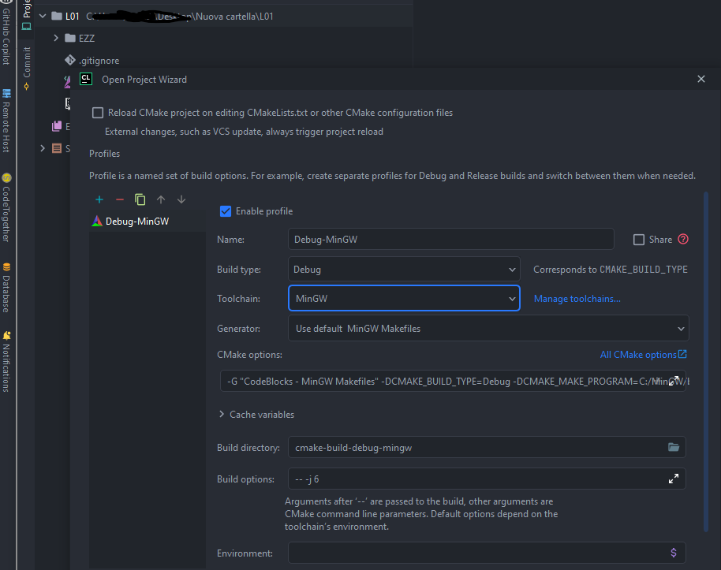

# Tecniche, Algoritmi, APA: THE CLION TEMPLATE

## What is this
This repository contains a CMake template, intended to quickly setup your lab projects, for the Politecnico di Torino courses  *APA* (deprecated), *Tecniche di Programmazione*,  *Algoritmi e Strutture Dati*.  

It is intended to be used with CLion, but if you feel brave you can use it without a GUI, or with VSCode.

It's **compatible** with Linux, Windows and Mac 

## Features - What does this template do
- Quick setup
- Build/Run all the lab's exercises configurations inside your IDE
    

      
  

- Import files via relative path
 

      
  

- Automatic export of the files for the lab delivery
    

      
  

## How to Setup your project
- Download this project on your machine (git clone or download zip)
- Rename the main folder as your Lab name *(e.g. L01 for lab1)*
  

      
  

- *(optional)* open it in CLion
  

      
  

  - If you opened it in CLion, set up your standard CMake configuration
  

      
  

- Create a copy of the `EZZ` directory for every exercise. Rename it as the exercise name *(e.g. E01 for ex.1)*
  

      
      
  

- Edit CMakeLists.txt:
  - `line 6`: set `LAB_NAME` variable as the lab name *(e.g. L03 for lab 3)*
  - `line 9`: add the exercise directory names *(e.g. set(DIRECTORIES E01 E02 E03))*
    

      
  

- Inside each exercise folder:
  - Edit CMakeLists.txt:
    - `line 4`  set `project()` as the exercise name *(e.g. E03 for exercise 3)*  
    - `line 8` add executable files if needed (.c and .h files)
    - `line 16` add/remove file names if needed
    

      
  

## How to export your project
This is automatic! Every time you build your exercise executable, CMake magic copies your .c, .h and text files in the
folder `[projectName]_export/[ExerciseName]/`, ready to be copy-pasted and delivered!

*note* The changes occur only when you build the project!  

### note about file handling 
This template tries to offer a quick solution for a very common problem: when opening a file, usually a lot of people
tries to open it using its relative path (e.g. `./file.txt`). This causes problems since the executable, when built,
usually looks for its relative path and doesn't find it, sinche the file itself doesn't get copied.

The "standard" solution is to include the full path (e.g. `C:\user\develop\file.txt`).

With this template CMake copies the files inside the build folder: this enables you to open your files using relative path.
To do so, you need to add the **relative path** (starting from the main.c location!) of the file to the exercises CMakeLists.txt.

It is *recommended* to add your files (also *.c and *h) into the same folder as your main.c !

### Problems? Bugs found?
Submit a [new issue](https://github.com/Barsay/Tecniche_Algoritmi_APA_lab_CLION_TEMPLATE/issues/new)

### Wanna contribute?
Submit a pull [request](https://github.com/Barsay/Tecniche_Algoritmi_APA_lab_CLION_TEMPLATE/compare)
